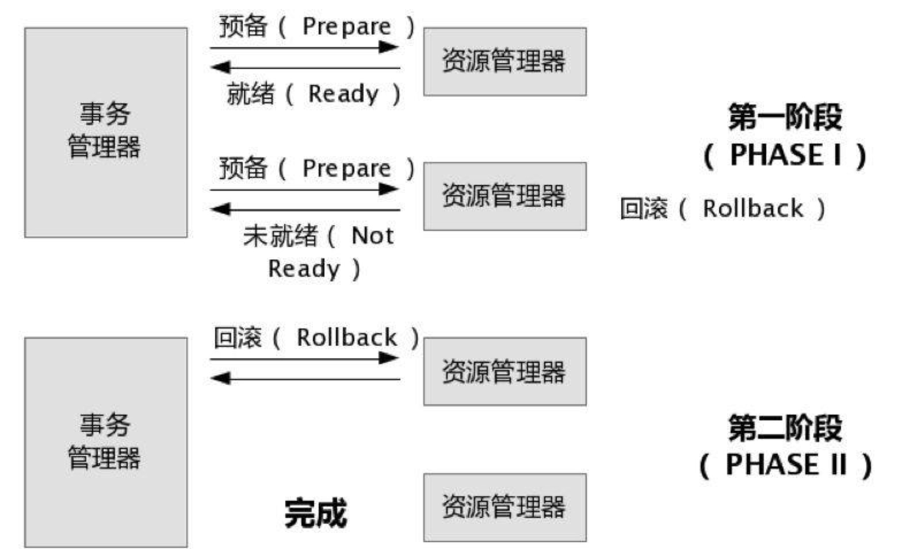
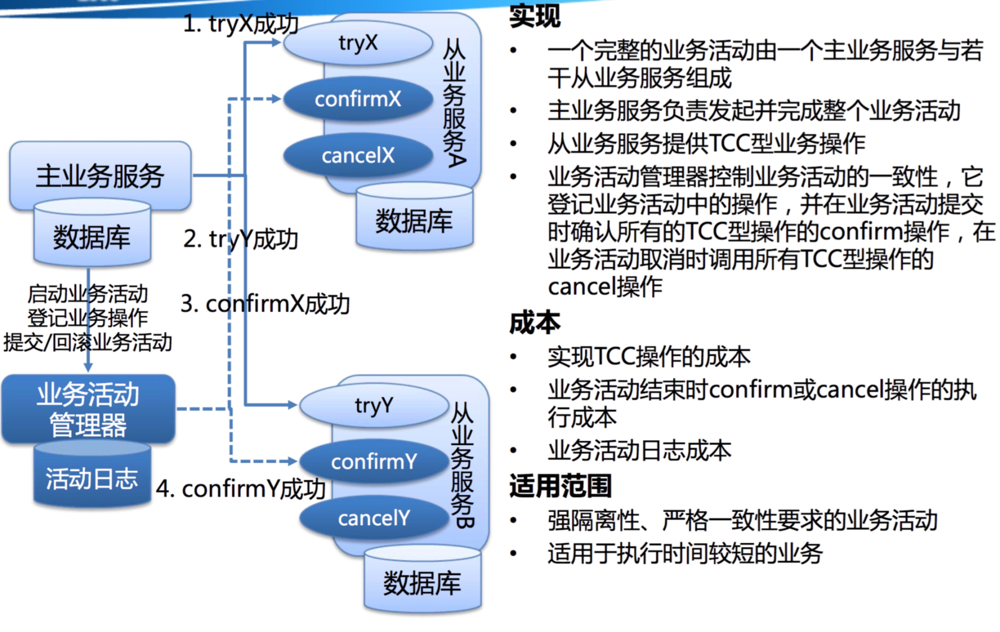

### 分布式事务

#### 2PC

在XA协议中分为两阶段:
第一阶段：事务管理器要求每个涉及到事务的数据库预提交(precommit)此操作，并反映是否可以提交.
第二阶段：事务协调器要求每个数据库提交数据，或者回滚数据。

优点： 尽量保证了数据的强一致，实现成本较低，在各大主流数据库都有自己实现，对于MySQL是从5.5开始支持。

缺点:
* 单点问题:事务管理器在整个流程中扮演的角色很关键，如果其宕机，比如在第一阶段已经完成，在第二阶段正准备提交的时候事务管理器宕机，资源管理器就会一直阻塞，导致数据库无法使用。
* 同步阻塞:在准备就绪之后，资源管理器中的资源一直处于阻塞，直到提交完成，释放资源。
* 数据不一致:两阶段提交协议虽然为分布式数据强一致性所设计，但仍然存在 数据不一致性的可能，比如在第二阶段中，假设协调者发出了事务commit的通知，但是因为网络问题该通知仅被一部分参与者所收到并执行了commit操作，其余的参与者则因为没有收到通知一直处于阻塞状态，这时候就产生了数据的不一致性。

#### TCC

关于TCC（Try-Confirm-Cancel）的概念，最早是由Pat Helland于2007年发表的一篇名为《Life beyond Distributed Transactions:an Apostate’s Opinion》的论文提出。
TCC事务机制相比于上面介绍的XA，解决了其几个缺点:
1.解决了协调者单点，由主业务方发起并完成这个业务活动。业务活动管理器也变成多点，引入集群。
2.同步阻塞:引入超时，超时后进行补偿，并且不会锁定整个资源，将资源转换为业务逻辑形式，粒度变小。
3.数据一致性，有了补偿机制之后，由业务活动管理器控制一致性

对于TCC的解释:
* Try阶段：尝试执行,完成所有业务检查（一致性）,预留必须业务资源（准隔离性）
* Confirm阶段：确认执行真正执行业务，不作任何业务检查，只使用Try阶段预留的业务资源，Confirm操作满足幂等性。要求具备幂等设计，Confirm失败后需要进行重试。
* Cancel阶段：取消执行，释放Try阶段预留的业务资源
Cancel操作满足幂等性Cancel阶段的异常和Confirm阶段异常处理方案基本上一致。

对于TCC来说适合一些:
* 强隔离性，严格一致性要求的活动业务。
* 执行时间较短的业务

#### 本地事件表

此方案的核心是将需要分布式处理的任务通过消息日志的方式来异步执行。消息日志可以存储到本地文本、数据库或消息队列，再通过业务规则自动或人工发起重试。人工重试更多的是应用于支付场景，通过对账系统对事后问题的处理。

对于本地消息队列来说核心是把大事务转变为小事务。还是举上面用100元去买一瓶水的例子。
1.当你扣钱的时候，你需要在你扣钱的服务器上新增加一个本地消息表，你需要把你扣钱和写入减去水的库存到本地消息表放入同一个事务(依靠数据库本地事务保证一致性。
2.这个时候有个定时任务去轮询这个本地事务表，把没有发送的消息，扔给商品库存服务器，叫他减去水的库存，到达商品服务器之后这个时候得先写入这个服务器的事务表，然后进行扣减，扣减成功后，更新事务表中的状态。
3.商品服务器通过定时任务扫描消息表或者直接通知扣钱服务器，扣钱服务器本地消息表进行状态更新。
4.针对一些异常情况，定时扫描未成功处理的消息，进行重新发送，在商品服务器接到消息之后，首先判断是否是重复的，如果已经接收，在判断是否执行，如果执行在马上又进行通知事务，如果未执行，需要重新执行需要由业务保证幂等，也就是不会多扣一瓶水。
本地消息队列是BASE理论，是最终一致模型，适用于对一致性要求不高的。实现这个模型时需要注意重试的幂等。

#### MQ事务
在MQ内部实现本地事件表，本质上是本地事件

#### Saga事务
Saga是30年前一篇数据库伦理提到的一个概念。其核心思想是将长事务拆分为多个本地短事务，由Saga事务协调器协调，如果正常结束那就正常完成，如果某个步骤失败，则根据相反顺序一次调用补偿操作。
Saga的组成：
每个Saga由一系列sub-transaction Ti 组成
每个Ti 都有对应的补偿动作Ci，补偿动作用于撤销Ti造成的结果,这里的每个T，都是一个本地事务。
可以看到，和TCC相比，Saga没有“预留 try”动作，它的Ti就是直接提交到库
Saga的执行顺序有两种：
T1, T2, T3, ..., Tn
T1, T2, ..., Tj, Cj,..., C2, C1，其中0 < j < n

华为servicecomb实现了saga

#### 总结
* 强一致性事务：
    * 2PC，TCC
* 最终一致事务：
    * 本地事件，MQ事务，Saga事务