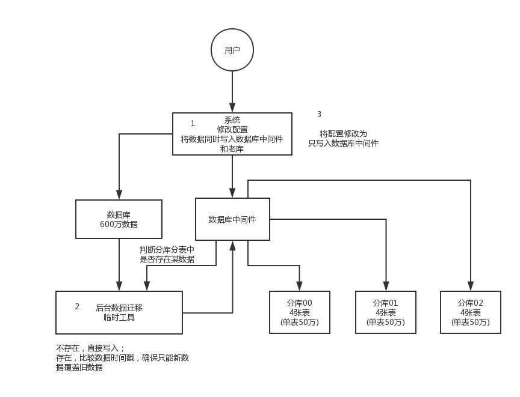
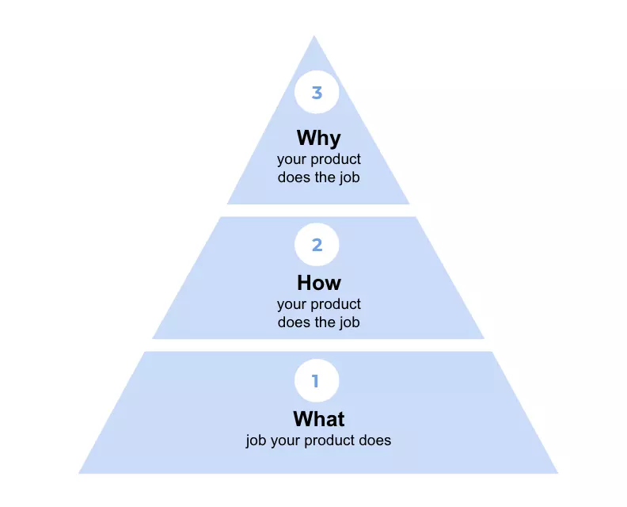

# Algorithm
> https://leetcode.com/problems/factorial-trailing-zeroes/description/

## 醍醐灌顶的解法

- 初步看到这道题，我首先是懵逼的，阶乘结果有多少个0？what??!
- 硬来肯定是不行的，仔细一想，会出现零只有一种情况嘛：2*5=10；
- 所以我们可以将阶乘进行因式分解，比如5！=1*2*3*4*5=1*2*3*2*2*5,共有1对2*5，所以结果就只有一个0嘛；有几对2*5,结果就有几个0！
- 所以问题就简化为找有几对2*5,能不能进一步简化捏？必须可以啊!
- 我们发现2的个数是远远多于5的，所以最终简化为了找出5的个数！
- 如果找出5的个数呢，比如20!，从1到20,共有5，10，15,20,共有4个5，即结尾0的个数为n/5！
- 这样就ok么？当然没ok，25!结果不只是25/5=5个0，25结果有6个0,因为25=5*5，有两个5。所以结果f(n)=n/5+f(n/5)!

```java
class Solution {
    public int trailingZeroes(int n) {
        int result=0;
        while (n>0){
            result+=n/5;

            n/=5;
        }
        return result;
    }
}
```

# Review
> https://developer.ibm.com/tutorials/l-awk1/

## The first awk
```
$ awk '{ print }' /etc/passwd
```

```
$ awk '{ print $0 }' /etc/passwd
```

## Multiple fields
```
awk -F":" '{ print $1 $3 }' /etc/passwd
```

```
awk -F":" '{ print "username: " $1 "\t\tuid:" $3 }' /etc/passwd
```

## External scripts
指定脚本文件

```
awk -f myscript.awk myfile.in
```

``` 
# myscript.awk
BEGIN { 
        FS=":" 
} 
{ print $1 }
```
EGIN块是在awk开始处理输入文件之前计算的，所以它是初始化FS(字段分隔符)变量、打印标题或初始化其他全局变量的绝佳位置，稍后您将在程序中引用这些全局变量。

Awk还提供了另一个特殊的块，称为END块。Awk在处理完输入文件中的所有行之后执行这个块。通常，END块用于执行最终计算或打印应该出现在输出流末尾的摘要。

## Regular expressions and blocks

```
/foo/ { print }
```

```
/[0‑9]+\.[0‑9]∗/ { print }
```

## Expressions and blocks
``` 
$1 == "fred" { print $3 }
```

```
$5 ~ /root/ { print $3 }
```

## Conditional statements
```
{ 
  if ( $5 ~ /root/ ) { 
          print $3 
  } 
}
```
下面是一个更复杂的条件表达式
```
{ 
  if ( $1 == "foo" ) { 
           if ( $2 == "foo" ) { 
                    print "uno" 
           } else { 
                    print "one" 
           } 
  } else if ($1 == "bar" ) { 
           print "two" 
  } else { 
           print "three" 
  } 
}
```

## Numeric variables!
```
BEGIN { x=0 } 
/^$/  { x=x+1 } 
END   { print "I found " x " blank lines. :)" }
```

## Stringy variables
``` 
x="1.01" 
#We just set x to contain the ∗string∗ "1.01" 
x=x+1 
#We just added one to a ∗string∗ 
print x 
#Incidentally, these are comments :)
```
会输出 2.01

## Lots of operators
awk的另一个好处是它有完整的数学运算符。除了标准的加法、减法、乘法和除法之外，awk还允许我们使用前面演示的指数运算符“^”、模(余数)运算符“%”

其中包括(i++, -foo)、加减乘除赋值运算符(a+=3，b*=2，c/=2.2，d-=6.2)。但这还不是全部——我们也可以方便地分配模/指数运算(a^=2，b%=4)。

# Tips
> 现在有一个未分库分表的系统，未来要分库分表，如何设计才可以让系统从未分库分表动态切换到分库分表上？
  
## 双写迁移方案

这个是我们常用的一种迁移方案，比较靠谱一些，不用停机，不用看长沙凌晨 4 点的风景。

简单来说，就是在线上系统里面，之前所有写库的地方，增删改操作，除了对老库增删改，都加上对新库的增删改，这就是所谓的双写，同时写俩库，老库和新库。

然后系统部署之后，新库数据差太远，用之前说的导数工具，跑起来读老库数据写新库，写的时候要根据 gmt_modified 这类字段判断这条数据最后修改的时间，除非是读出来的数据在新库里没有，或者是比新库的数据新才会写。简单来说，就是不允许用老数据覆盖新数据。

导完一轮之后，有可能数据还是存在不一致，那么就程序自动做一轮校验，比对新老库每个表的每条数据，接着如果有不一样的，就针对那些不一样的，从老库读数据再次写。反复循环，直到两个库每个表的数据都完全一致为止。

接着当数据完全一致了，就 ok 了，基于仅仅使用分库分表的最新代码，重新部署一次，不就仅仅基于分库分表在操作了么，还没有几个小时的停机时间，很稳。所以现在基本玩儿数据迁移之类的，都是这么干的。



# Share
> [四个「为什么」：是什么在背后驱动你的产品？](https://juejin.im/post/5bac279cf265da0adc18d31a)

## 决定你产品背后的「为什么」

```
「人们经常问，10年后世界上会有什么不同，但我认为更重要的是，10年后还有什么不变」
                                        — Jeff Bezos
```

是的，因为人们想要且需要的真理恰恰是基本的事实。在我作为产品团队负责人期间，我找到了几乎可以应用到所有消费体验和产品的四个模型。他们并不互斥 —— 在很多方向他们是互相覆盖的，但其中一个可能比其他的更值得你关注。

### 什么是你的客户的稀缺资源
什么是你的客户缺乏的资源？一般来说有三个方面 —— 钱、时间、精力。


这就是 Bezos 提出的「10 年后世界上还有什么不变」这个问题的答案 —— 亚马逊的客户总是想要更低的价格（金钱）和更快的运输（时间），亚马逊的战略就是通过专注于这些核心客户需求而建立的。

这也是为什么 Uber 的商业模式不是「卖车」，而是「卖时间」。

### 六大核心需求
Tony Robbins 主张六大核心需求驱动着人们的行为：

* 确定性：对安全性，稳定性，可预测性和舒适性的需求
* 不确定性/多样性：对惊喜，兴奋，新奇，变化的需求
* 爱与联系：对社会依附、认可，感受到联系和爱的需求
* 重要性：对存在意义、自尊心，感受到特别和被需要的需求
* 成长：对不断发展智力、情感、精神的需求
* 贡献：对给予、保护、关心、服务他人的需求

举个例子，Facebook 解决了（1）爱与联系……通过与朋友的联系，（2）重要性……通过接收你发布的内容的回复/点赞，以及（3）多样性……你永远不知道你的订阅中会出现什么。

### 七个致命原罪

再让我们来看看负面，许多产品也解决了以下七个致命原罪的一种：

- 骄傲
- 贪婪
- 性欲
- 嫉妒
- 暴食
- 懒惰
- 愤怒

针对这七种致命原罪中的一种设计的产品常常让人上瘾。在这个框架中，Facebook 解决了骄傲。Uber 和 Amazon 解决了懒惰和贪婪。

### 生命的目的框架
最后，但并非不重要的是，一些心理学家提供了生命的目的框架：

* 对于弗洛伊德来说，是追寻快乐
* 对于尼采来说，是追寻权利
* 对于弗兰克尔来说，是追寻意义

行为改变和认知偏见背后的一个关键根源是我们追寻快乐、避免痛苦，这也是你设计产品体验时的伟大洞察点。

我们看到专注于用户追寻意义的产品或服务的兴起。比如正念 和冥想产品，或者诸如 Toms 和 Feed 这种回馈世界的产品。
