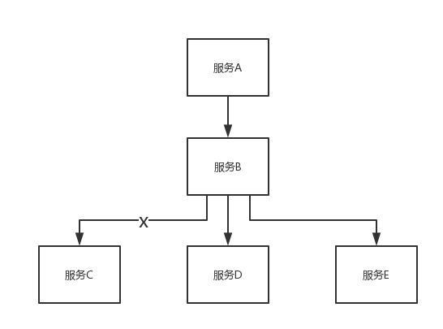

# Algorithm
> https://leetcode.com/problems/majority-element/description/

## 思路
符合直觉的做法是利用额外的空间去记录每个元素出现的次数，并用一个单独的变量记录当前出现次数最多的元素。
但是这种做法空间复杂度较高，有没有可能进行优化呢？ 答案就是用"投票算法"。
投票算法的原理是通过不断消除不同元素直到没有不同元素，剩下的元素就是我们要找的元素。


```java
class Solution {
    public static int majorityElement(int[] nums) {
		int count = 1;
		int majorNum = nums[0];
		for (int i = 1; i < nums.length; i++) {
			if (count == 0) {
				majorNum = nums[i];
			}
			if (majorNum == nums[i]) {
				count++;
			}
			else {
				count--;
			}
		}
		return majorNum;
	}
}
```

# Review
> https://milapneupane.com.np/2019/07/06/how-does-a-cpu-work/
> https://blog.csdn.net/u010926964/article/details/45693773

## CPU的基本知识

### CPU的功能
1. 程序控制
    CPU通过执行指令来控制程序的执行顺序，这是CPU的重要职能。

2. 操作控制
    一条指令功能的实现需要若干个操作信号来完成，CPU产生每条指令的操作信号并将操作信号送往不同的部件，控制相应的部件按指令的功能要求进行操作。

3. 时间控制
    CPU对各种操作进行时间上的控制，这就是时间控制。CPU对每条指令的整个执行过程要进行严格控制，即指令执行过程中操作信号的出现时间、持续时间及出现的时间顺序都需要进行严格控制。

4. 数据处理
    CPU通过对数据进行算术运算及逻辑运算等方式进行加工处理，数据加工处理的结果被人们所利用。所以，对数据的加工处理也是CPU最根本的任务。

### CPU的组成
CPU主要有运算器、控制器、寄存器组合内部总线等部件组成。

* 运算器

    运算器由算术逻辑单元（Arithmetic and Logic Unit，ALU），累加寄存器（AC），数据缓冲寄存器（DR），和状态条件寄存器组成，它是数据加工处理部件，完成计算机的各种算术和逻辑运算。相对于控制器而言，运算器接受控制器的命令而进行动作，即运算器所进行的全部操作都是由控制器发出的控制信号来指挥的，所以它是执行部件。
   * 算术逻辑单元（ALU）
        ALU是运算器的重要组成部件，负责处理数据，实现对数据的算术运算和逻辑运算。
   * 累计寄存器（AC）
        AC通常简称为累计器，它是一个通用寄存器，其功能是当运算器的算术逻辑单元执行算术或逻辑运算时，为ALU提供一个工作区。最后的运算结果放到AC中，因此运算器中至少有一个累加寄存器。
   * 数据缓冲寄存器（DR）
        在对内部存储器进行读写操作时，用DR暂时存放由内存储器读写的一条指令或一个数据字，将不同时间段内读写的数据隔离开来。DR作为CPU和内存、外部设备之间的数据传送中转站；作为CPU和内存、外围设备之间在操作速度上的缓冲；在单累加器结构的运算器中，DR还可以件作为操作数寄存器。
   * 状态条件寄存器（PSW）
        PSW保存由算术指令和逻辑指令运行或测试的结果建立的各种条件码内容，主要分为状态标志和控制标志。这些标志通常由一位触发器保存，保存了当前指令执行完成之后的状态。通常一个算术操作产生一个运算结果，一个逻辑操作产生一个判决。

* 控制器

    运算器只能完成运算，而控制器用于控制整个CPU的工作，他决定了计算机运行过程的自动化。它不仅要保证程序的正确执行，而且要能够处理异常事件。控制器一般包括指令控制逻辑、时序控制逻辑、总线控制逻辑和中断控制逻辑等几个部分。
时序控制逻辑要为每条指令按时间顺序提供应有的控制信号。总线逻辑是为多个功能部件服务的信息通路控制电路。中断控制逻辑用于控制各种中断请求，并根据优先级的高低对中断请求进行排队，逐个交给CPU处理。
指令控制逻辑要完成取指令、分析指令和执行指令的操作，其过程分为取指令、指令译码、按指令操作码执行、形成下一条指令等步骤。
   * 指令寄存器（IR）
        当CPU执行一条指令时，先把它从内存储器取到缓冲寄存器中，在送入IR暂存，指令译码器根据IR的内容产生各种微操作指令，控制其他的组成部件工作，完成所需的功能。

   * 程序计数器（PC）
        PC具有寄存信息和计数两种功能，又称为指令计数器。程序的执行分为两种情况，一是顺序执行，而是转移执行。当程序开始执行前，将程序的起始地址送入PC，该地址在程序加载到内容是确定，因此PC的内容即是程序第一条指令的地址。执行指令时CPU自动修改PC的内容，以便使其保持的总是将要执行的下一条指令的地址。

   * 地址寄存器（AR）
        AR保存当前CPU所访问的内存单元的地址。由于内存和CPU存在着操作速度上的差异，所以需要使用AR保持地址信息，知道内存的读写操作完成为止。

   * 指令译码器（ID）
        指令分为操作码和地址码两部分，为了能执行任何给定的指令，必须对操作码进行分析，以便识别所完成的操作。ID就是对指令中的操作码字段进行分析解释，识别该指令规定的操作，向操作控制器发出具体的控制信号，控制各部件工作，完成所需的功能。

* 寄存器组

    寄存器组可分为专用寄存器和通用寄存器。运算器和控制器中的寄存器是专用寄存器，起作用是固定的。通用寄存器用途广泛并可由程序员规定其用途，其数目因处理器不同有所差异。
    
# Tips
> [用 Hystrix 构建高可用服务架构](https://github.com/doocs/advanced-java/blob/master/docs/high-availability/hystrix-introduction.md)

## 用 Hystrix 构建高可用服务架构
参考 [Hystrix Home](https://github.com/Netflix/Hystrix/wiki#what)。

### Hystrix 是什么？
在分布式系统中，每个服务都可能会调用很多其他服务，被调用的那些服务就是**依赖服务**，有的时候某些依赖服务出现故障也是很正常的。

Hystrix 可以让我们在分布式系统中对服务间的调用进行控制，加入一些**调用延迟**或者**依赖故障**的**容错机制**。

Hystrix 通过将依赖服务进行**资源隔离**，进而阻止某个依赖服务出现故障时在整个系统所有的依赖服务调用中进行蔓延；同时Hystrix 还提供故障时的 fallback 降级机制。

总而言之，Hystrix 通过这些方法帮助我们提升分布式系统的可用性和稳定性。

### Hystrix 的历史
Hystrix 是高可用性保障的一个框架。Netflix（可以认为是国外的优酷或者爱奇艺之类的视频网站）的 API 团队从 2011 年开始做一些提升系统可用性和稳定性的工作，Hystrix 就是从那时候开始发展出来的。

在 2012 年的时候，Hystrix 就变得比较成熟和稳定了，Netflix 中，除了 API 团队以外，很多其他的团队都开始使用 Hystrix。

时至今日，Netflix 中每天都有数十亿次的服务间调用，通过 Hystrix 框架在进行，而 Hystrix 也帮助 Netflix 网站提升了整体的可用性和稳定性。

[2018 年 11 月，Hystrix 在其 Github 主页宣布，不再开放新功能，推荐开发者使用其他仍然活跃的开源项目](https://github.com/Netflix/Hystrix/blob/master/README.md#hystrix-status)。维护模式的转变绝不意味着 Hystrix 不再有价值。相反，Hystrix 激发了很多伟大的想法和项目，我们高可用的这一块知识还是会针对 Hystrix 进行讲解。

### Hystrix 的设计原则
- 对依赖服务调用时出现的调用延迟和调用失败进行**控制和容错保护**。
- 在复杂的分布式系统中，阻止某一个依赖服务的故障在整个系统中蔓延。比如某一个服务故障了，导致其它服务也跟着故障。
- 提供 `fail-fast`（快速失败）和快速恢复的支持。
- 提供 fallback 优雅降级的支持。
- 支持近实时的监控、报警以及运维操作。


举个栗子。

有这样一个分布式系统，服务 A 依赖于服务 B，服务 B 依赖于服务 C/D/E。在这样一个成熟的系统内，比如说最多可能只有 100 个线程资源。正常情况下，40 个线程并发调用服务 C，各 30 个线程并发调用 D/E。

调用服务 C，只需要 20ms，现在因为服务 C 故障了，比如延迟，或者挂了，此时线程会 hang 住 2s 左右。40 个线程全部被卡住，由于请求不断涌入，其它的线程也用来调用服务 C，同样也会被卡住。这样导致服务 B 的线程资源被耗尽，无法接收新的请求，甚至可能因为大量线程不断的运转，导致自己宕机。服务 A 也挂。



Hystrix 可以对其进行资源隔离，比如限制服务 B 只有 40 个线程调用服务 C。当此 40 个线程被 hang 住时，其它 60 个线程依然能正常调用工作。从而确保整个系统不会被拖垮。

### Hystrix 更加细节的设计原则
- 阻止任何一个依赖服务耗尽所有的资源，比如 tomcat 中的所有线程资源。
- 避免请求排队和积压，采用限流和 `fail fast` 来控制故障。
- 提供 fallback 降级机制来应对故障。
- 使用资源隔离技术，比如 `bulkhead`（舱壁隔离技术）、`swimlane`（泳道技术）、`circuit breaker`（断路技术）来限制任何一个依赖服务的故障的影响。
- 通过近实时的统计/监控/报警功能，来提高故障发现的速度。
- 通过近实时的属性和配置**热修改**功能，来提高故障处理和恢复的速度。
- 保护依赖服务调用的所有故障情况，而不仅仅只是网络故障情况。

  
# Share
> https://mp.weixin.qq.com/s/DAHflDct1e-r_Z_Js-1Ihg

## 第一阶段
对于从事 Java 软件开发的技术同学，在毕业后的 3 到 5 年内主要都是以学习、积累为主。
这个阶段的工作几乎每天都有惊喜，都有收获。从一开始啥都不懂的校园“新鲜人”向“职业人”转变。

* **基础的 Java 知识**：你会开始看《Java编程思想》、《Effective Java》。

* **高质量代码进阶知识**：你会开始看《重构：改善既有代码的设计》、《代码大全》、《编程珠玑》。

* **常用的主流框架**：比如 SSH 相关的《Spring实战》、《Spring Boot实战》、《Hibernate实战(第2版)》。

当然，这些书已经不够了，你会通过 Google、Baidu 大量地浏览在线的资源：Apache官网、Spring官网、Hibernate官网。你会去 Stack Overflow 问问题或找答案。

* **系统设计与算法知识**：《系统分析与设计方法》、《设计模式》、《需求分析与系统设计》、《面向对象分析与设计》、《UML用户指南》、《算法导论》。

* **其他知识**：比如数据库调优、缓存框架、NoSQL 数据库、日志框架等等。

## 第二阶段
很多本科同学，特别是研究生同学。在毕业 10 年后，就已经到了 34、35 岁左右了。也是前段时间网上广泛讨论的所谓 34+ 岁现象。
其实，年龄并不是问题的真正原因。真正的原因还是在于自身“竞争力”是否符合这个年龄所应该具备的。
到了这个年龄的人，往往已经不是“个人贡献者”了，而是“团队贡献者”。团队贡献者可能是带团队的 Team Leader，也可能是个架构师，在技术决策上具有团队影响力和话语权。

**对所负责领域的业务特点、发展趋势、友商竞争分析有很好的洞察？能知道这个业务领域的客户是谁？他们的需求是什么？他们的痛点是什么？**

所以，这个 Team Leader 应该需要学习《咨询的奥秘》、《探索需求》、《系统化思维导论》。对于技术型的 Team Leader，还应该了解《成为技术领导者：掌握全面解决问题的方法》。

**服务于特定领域的客户，我们需要了解我们客户的企业架构、业务知识。要了解清楚规划的产品、服务，什么才是客户所需要的。**

那么，从理论上，我们是否应该学习一些 TOGAF、NGOSS、ITIL 等业务理论以及业务知识？

**作为 Team Leader，是否有必要能将自己对于市场的洞察转换成业务规划，并能向自己的老板（或者投资人）说清楚、讲明白？并争取到老板的同意，包括资金、人力资源等。**

对于，能否把事情讲明白，我们可能需要学习《金字塔原理》，并能非常清晰、有逻辑性地进行表达与沟通。

当然，有些业务发展的事不一定特别有逻辑，是需要摸索、尝试的，那么你是否能将一个不确定的领域说服老板并获得支持，我们又需要什么？《博弈论》、《影响力》等。

**获得老板支持后，就需要开始带着兄弟们干活了。作为带头人，你看我们是否需要能将业务趋势、客户痛点进行业务建模好让团队的 PD、技术都能理解？**

在做业务进一步深入分析，可能就需要学习《领域驱动设计：软件核心复杂性应对之道》、《实现领域驱动设计》、《企业应用架构模式》、《恰如其分的软件架构》等等。

**做完业务设计后，开始要带着团队做技术方案设计、接口设计以及编码实现等。这个过程，Team Leader 又需要具备软件项目管理的能力。**

无论是《PMBOK指南》，还是《敏捷软件开发》、《人月神话》、《程序开发心理学》，相信总归还是会有点帮助的。

**对于一些有国际化要求的公司，还需要再学习英语吧！**

**嗯，还需要有个好的身体，还需要经常锻炼，学习科学的健身吧（说起来自己脸红）。**

至少我明白了一个道理，以前我都是跟自己说，等这段时间过了，闲下来去锻炼一下。其实，我发现，越是忙的时候，越需要锻炼身体！

**另外，在这 10 年内，比较关键的是——你还经历过什么有挑战的业务、技术、产品、平台等方面的成功与失败经验？**